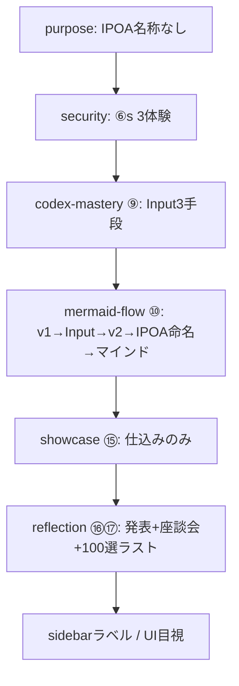

# 講義サイト — Grill-me体験反映 実装プラン & TDD

> **スコープ**: コンポーネント・デプロイは済。**「言ったことがInputとして載っているか」**の体験順序を mdx に反映する。  
> **正本**: `talk-script.md` > `plan.md` > Grill-me トランスクリプト  
> **監査表**: [`SESSION_INPUT_AUDIT.md`](SESSION_INPUT_AUDIT.md)  
> **UXジャーニー**: [`UX_JOURNEY_AUDIT.md`](UX_JOURNEY_AUDIT.md)（感情設計・演習順序・P0-P2チェックリスト）  
> **自動検証**: [`site/scripts/verify-training-content.mjs`](site/scripts/verify-training-content.mjs)

---

## 1. 何が足りないか（1行）

インフラ（ImageText / StepFlow / build / deploy）は進んだが、**⑨→⑩のInput体験**・**⑥sセキュリティ共通体験**・**⑮仕込み→⑯発表→⑰100選**の**感情設計順**が mdx に未反映。

---

## 2. 設計の因果連鎖（この順で直す）



**原則**: IPOAは**体験の後に名前を付ける**。100選の「量の一望」は**全員発表の後**だけ。

---

## 3. TDD ワークフロー（次セッションの手順）

### 3.1 配線（最初の5分）

`site/package.json` の `scripts` に追加:

```json
"verify": "node scripts/verify-training-content.mjs"
```

### 3.2 Red → Green → Refactor

| 段階 | コマンド | 成功条件 |
|------|----------|----------|
| **Red** | `cd site && pnpm verify` | 現状 **8 FAIL**（2026-06-20 時点）。意図的に赤のまま開始してよい |
| **Green** | mdx を1ファイルずつ修正 → 都度 `pnpm verify` | **23/23 PASS** |
| **Refactor** | 重複プロンプト整理・IntroPunch文言調整 | verify が緑のまま |
| **Build** | `pnpm build` | エラーなし |
| **監査更新** | `SESSION_INPUT_AUDIT.md` の ✅/△/❌ を verify 結果に合わせて更新 | 表と自動テストが一致 |
| **Deploy**（任意） | `cd .. && vercel deploy --prod --yes --scope sento-group` | 本番反映 |

### 3.3 1ファイル = 1コミット単位（推奨）

verify ID がファイル単位にまとまっているので、**1 mdx 修正 → verify → commit** が追いやすい。

---

## 4. 現状ベースライン（2026-06-20）

```
pnpm verify → 15/23 PASS

FAIL  ipoa-after-experience      mermaid-flow: IPOA が 進め方 より前
FAIL  mermaid-mind-guide         mermaid-flow: ## 軽いマインド なし
FAIL  codex-voice-exercise       codex-mastery: 音声+2分+演習 不足
FAIL  codex-business-docs        codex-mastery: 業務資料/議事録 不足
FAIL  codex-handwritten-photo    codex-mastery: 手書き+写真 不足
FAIL  security-agents-fallback   security: AGENTS.md なし
FAIL  showcase-is-prep             showcase: ⑮が内覧扱い（仕込みでない）
FAIL  reflection-zadankai        reflection: 座談会 明示なし

PASS  purpose-no-ipoa-name       purpose から IPOA 削除済み
PASS  reflection-tomorrow-input / reflection-100-peak 等
```

---

## 5. ファイル別 実装仕様（Acceptance Criteria）

### P0-1 `day-1/mermaid-flow.mdx`（⑩・最重要）

**talk-script 対応**: L134–151（v1→Input→v2→IPOA初出→軽いマインド）

| 要件 | 受け入れ基準（verify ID） |
|------|---------------------------|
| セクション順 | `## 進め方`（StepFlow: v1→Input追加→v2→差分）→ **その後** `## IPOA` |
| 合言葉 | `## IPOA` 内に「IPOA回そう＝Input足してもう一回」 |
| コピペ | v1用・v2用の ` ```text ` プロンプト各1本以上 |
| マインド | `## 軽いマインド` を IPOA の直後（1画面・短く） |
| 手書き | 手書き＋写真の流れ（⑨との接続を1行で明示） |
| IntroPunch | 「IPOAが身体化」等の**先出し命名**は削除 or ⑩後に移動 |

**構成テンプレ（見出し順のみ）**:

```
Intro（IPOAという語は出さない）
## 進め方  ← StepFlow + v1/v2 プロンプト
## IPOA    ← ここで初めて命名 + 合言葉
## 軽いマインド
おかわり / トラブル
```

---

### P0-2 `day-1/codex-mastery.mdx`（⑨）

**talk-script 対応**: L116–123（Input3手段）

| 手段 | ページに載せる内容 | verify ID |
|------|-------------------|-----------|
| 音声 | ホットキー→**2分**喋る→Codexに貼る。**演習**として全員やる手順 | `codex-voice-exercise` |
| 辞書 | 固有名詞・会社名の単語登録手順 | `codex-dictionary`（PASS済み要維持） |
| 業務資料 | 議事録・メール・Excel手順を**指すだけ**でInput | `codex-business-docs` |
| 写真 | 手書きメモ・ホワイトボードを**写真**→⑩のMermaid材料 | `codex-handwritten-photo` |

**UI**: 各手段を `StepFlow` + コピペプロンプト（` ```text `）で。箇条書きだけにしない。

---

### P0-3 `day-1/security.mdx`（⑥s）

**talk-script 対応**: AM セキュリティ共通体験

| 要件 | 受け入れ基準 |
|------|-------------|
| 学習OFF | ChatGPT「学習に使用しない」確認手順 | `security-learning-off`（維持） |
| ガードレール | **コピペ用**コードブロックに全文 | `security-guardrail-block`（維持・中身を実文に） |
| ダミー違反 | ダミーAPIキー等を貼る→**警告**を見る演習手順 | `security-dummy-violation`（維持） |
| Fallback | hook が無い環境向け **AGENTS.md** 貼り付け手順 | `security-agents-fallback` |

---

### P1-1 `day-2/showcase.mdx`（⑮）

**talk-script 対応**: L187–189（仕込みのみ）

| やる | やらない |
|------|----------|
| 振り返り skill 登録 | 100選を**ここで一望**させない |
| 成果物フォルダ・リンク集の**準備** | 「明日Input宣言」（→ reflection へ） |
| タイトル・Intro に **仕込み** | Step「100選を開く」系 |

verify: `showcase-is-prep`

---

### P1-2 `day-2/reflection.mdx`（⑯⑰）

**talk-script 対応**: L191–200

| ブロック | 内容 | verify ID |
|----------|------|-----------|
| ⑯ | 全員発表 + **座談会**（伸びたら座談会を削るルール） | `reflection-zadankai` |
| ⑯ | **明日試すInput1個**を全員口に出す | `reflection-tomorrow-input`（維持） |
| ⑰ | 講師生成 **100選** の**量の一望**（発表の後） | `reflection-100-peak`（維持・強化） |
| ⑰ | 二段クローズ：達成→渇望（埋め続ける器） | 目視 |

showcase から移す要素: 100選内覧・明日Input宣言（showcase に残っていたら削除）。

---

### P1-3 `astro.config.mjs`（sidebar）

| 現状 | 変更案 |
|------|--------|
| `100選内覧` → showcase | `振り返りskill・仕込み` 等（内覧を連想させない） |
| 順序 production → showcase → reflection | talk-script ⑮→⑯→⑰ と一致（現順序はOK、**ラベルのみ**） |

verify 対象外 → **目視チェックリスト**に記載。

---

### P2 UI/UX（verify 外・目視）

`IMPROVEMENTS_PLAN.md` / `TOP_UIUX_FIX_PLAN.md` 参照。

- TOP ハブ（`index.mdx`）の導線・密度
- タイトルサイズ（global.css 済み、ブラウザ確認）
- `IMAGE_TODO.md` の未撮影スクショ

---

## 6. verify テスト一覧（契約の正本）

| ID | ファイル | 検査内容 |
|----|----------|----------|
| `purpose-no-ipoa-name` | purpose.mdx | `IPOA` 文字列なし |
| `ipoa-after-experience` | mermaid-flow.mdx | `## 進め方` < `## IPOA` |
| `ipoa-slogan-location` | mermaid-flow.mdx | 合言葉 + IPOAセクション存在 |
| `mermaid-v1-prompt` | mermaid-flow.mdx | ゼロInput/v1 + コードブロック |
| `mermaid-v2-prompt` | mermaid-flow.mdx | v2 + 追加 |
| `mermaid-mind-guide` | mermaid-flow.mdx | `## 軽いマインド` |
| `handwritten-flow` | mermaid-flow.mdx | 手書き + 写真 |
| `no-todo-app` | mermaid-flow.mdx | ToDoアプリ言及なし |
| `codex-voice-exercise` | codex-mastery.mdx | 音声 + 2分 + 演習 |
| `codex-dictionary` | codex-mastery.mdx | 辞書 or 単語 |
| `codex-business-docs` | codex-mastery.mdx | 業務資料 or 議事録 |
| `codex-handwritten-photo` | codex-mastery.mdx | 手書き + 写真 |
| `security-learning-off` | security.mdx | 学習OFF |
| `security-guardrail-block` | security.mdx | ガードレール文 + コードブロック |
| `security-dummy-violation` | security.mdx | ダミー + 警告 |
| `security-agents-fallback` | security.mdx | AGENTS.md |
| `showcase-is-prep` | showcase.mdx | 仕込み or 振り返りskill |
| `showcase-100-words` | showcase+reflection | 100選 or 埋め続ける |
| `reflection-zadankai` | reflection.mdx | 座談会 |
| `reflection-tomorrow-input` | reflection.mdx | 明日試すInput |
| `reflection-100-peak` | reflection.mdx | 量の一望 or 100選 |
| `personality-extra-only` | extra/personality-html.mdx | 任意・おかわり |
| `no-three-months` | 受講者向け主要mdx | 3か月言及なし |

**将来強化（任意）**: `purpose-no-ipoa-name` を IntroPunch の `dakara` prop まで含めた AST 検査に。現状は全文 `IPOA` 禁止で十分。

---

## 7. 目視チェックリスト（verify 後）

- [ ] sidebar Day2: ⑮ラベルが「内覧」ではない
- [ ] ⑨→⑩を通読して「Input3手段→v1→Input→v2→IPOA命名」の流れが読者に追える
- [ ] ⑥s: 受講者がその場でコピペできるブロックがある
- [ ] agent-browser or 本番 URL で TOP・prep の画像プレースホルダ確認
- [ ] `talk-script.md` のタイムボックス（⑨70分・⑩85分）とページ分量が極端にズレていない

---

## 8. 次セッション起動プロンプト

```
/Users/wajimayuki/Cursor/general/IMPLEMENTATION_PLAN.md と SESSION_INPUT_AUDIT.md を読む。
site/package.json に verify スクリプトを追加 → pnpm verify（8 FAIL確認）
→ P0: mermaid-flow → codex-mastery → security → P1: showcase → reflection → sidebar
→ 23/23 PASS → pnpm build → 監査表更新。
実装は「Grill-meの体験順序」最優先。UI微調整は verify 緑の後。
```

---

## 9. やらないこと（スコープ外）

- 新規 Astro コンポーネント大量追加（既存 StepFlow / ImageText で足りる）
- personality-html の本流復帰
- 「3か月」ロードマップの受講者向け記載
- verify 未登録の細部（grill-me深掘りの文言一致など）— 目視で十分なもの
