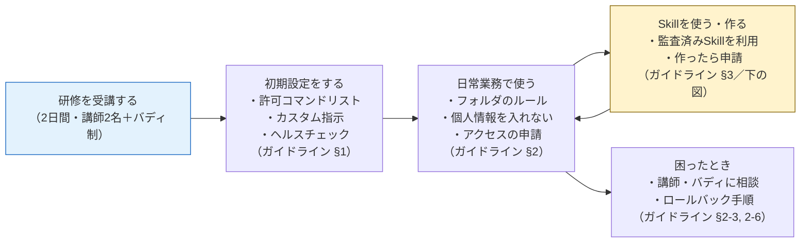
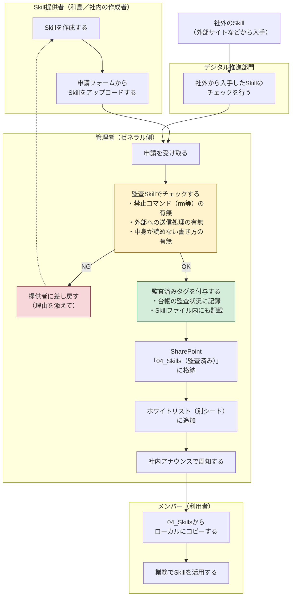
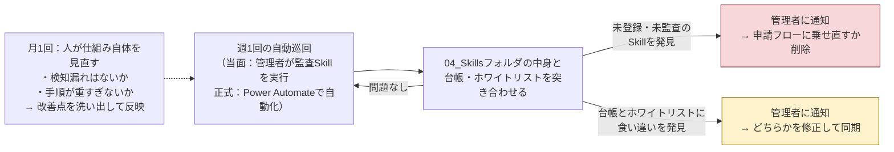

# ゼネラル Codex業務フロー（叩き・ver0）

---

## 0. これは何か

| 項目 | 内容 |
|---|---|
| 目的 | Codex利用の全体像と、Skillを増やす・配る・点検する流れを図で共有する |
| 読者 | ゼネラル社員全員（1枚目）、Skillに関わる全役割（2枚目） |
| 今の状態 | ver0。sento.group側で置いたたたき案。ゼネラル側と合意してから実装に入る |
| 関連文書 | [guideline.md](guideline.md)（Codex利用ガイドライン）／[rollout-policy.md](rollout-policy.md)（全社展開 方針概要書） |

---

## 1. 全体像：社員一人のCodex利用ライフサイクル

ゼネラル社員一人から見た「研修を受けてから日常的に使いこなすまで」の流れ。各ステップの詳しいルールはガイドラインの該当章へ。

---

## 2. 詳細：Skill管理フロー（役割別スイムレーン）

Skill＝Codexに覚えさせる手順のかたまり。誰が作ったSkillであっても、**申請フォームを唯一の入口**にして、管理者の監査を通ってから配布される。

### フローの補足

| ポイント | 内容 |
|---|---|
| 入口は1つ | 和島（sento）提供・社内作成のどちらも、同じ申請フォームから入る。例外ルートを作らない |
| 社外Skillだけ追加関門 | 外部サイトなどから入手したSkillは、先にデジタル推進部門のチェックを通してから管理者の監査へ |
| 台帳とホワイトリストの役割分担 | 台帳＝申請されたすべてのSkillの記録（NG含む）。ホワイトリスト＝監査OKで使用可のSkillだけの一覧（別シート） |
| メンバーはコピーして使う | 04_Skillsは読み取り専用。ローカルにコピーして使う（ガイドライン2-1のコピー原則と同じ） |

---

## 3. 定期監査の仕組み（自動チェックのループ）

配布して終わりではなく、置き場所を定期的に巡回して「台帳に載っていないSkill・監査を通っていないSkill」を検知する。

---

## 4. この体制で作る成果物一覧

| 成果物 | 中身 | 状態 |
|---|---|---|
| 暫定ガイドライン | Codex利用の最低限のルール集（guideline.md） | 叩きあり |
| 業務フロードキュメント | この文書（全体1枚＋Skill管理フロー） | 叩きあり（本書） |
| Skill元帳スプレッドシート | 台帳シート＋ホワイトリストシートの2枚構成。叩きはGoogleスプレッドシート、正式運用までにM365（SharePointリスト等）へ移行 | 叩きあり |
| 申請フォーム | Skill配布申請の入口。叩きはGoogleフォーム、正式はMicrosoft Forms | 未着手 |
| Skill監査Skill | スクリプトの中身・危険コマンド・外部送信の有無をチェックし、監査済みタグを付与する | 未着手 |
| 定期監査の自動化 | 04_Skillsを週1巡回して未登録Skill・台帳との食い違いを検知 | 未着手 |

---

## 変更履歴

- ver0：初版作成（全体ライフサイクル図・Skill管理スイムレーン図・定期監査ループ図の3点構成）
