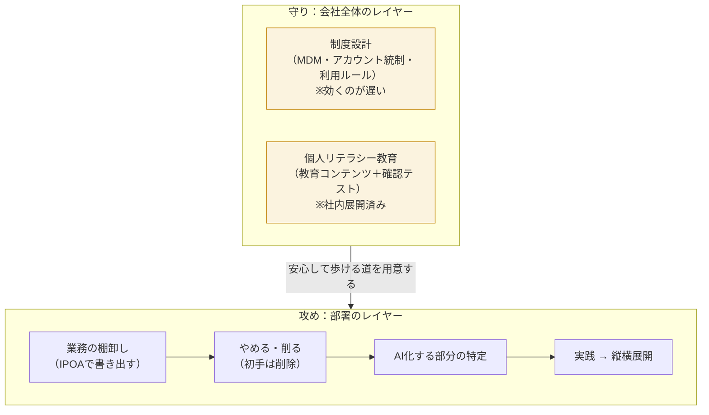
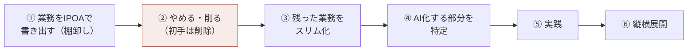
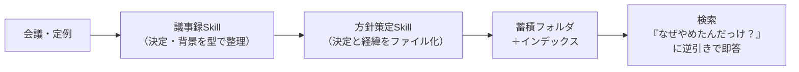

# ゼネラル AI活用 方針概要書 ver2.0

作成：sento.group ／ 2026-08-24 キックオフMTGの合意内容にもとづく
本書はガイドラインポータルに掲載し、継続的に更新する前提の文書です。

---

## 1. 一言でいうと

**「夜道を安心して歩けるようになろう」作戦。**
AIという便利だが危ない道を、通行止めにするのではなく、安心して歩ける状態を作って全員で歩く。

そのために、2本柱を**同時に並行して**進める。

| 柱 | 中身 | 進め方 |
|---|---|---|
| **守り** | 歯止め（ガードレール）を整えて、事故が起きない状態で使えるようにする | 制度設計＋個人のリテラシー教育の2段構え |
| **攻め** | 部署の業務を棚卸しして、業務の成果（工数削減）を出す | 工数削減専任チーム（6名）が実行する |

なぜ2本同時か：守りのうち**制度（MDMなどの会社設定）は効くまでに時間がかかる**。制度が効くまでの間は、個人のリテラシーと運用の仕組みで自衛するしかない。だから遅い方（制度）を進めつつ、速い方（教育・仕組み）を並行で走らせる。

---

## 2. ゴールと今回の経緯

### 最終ゴール

**業務の成果を創ること。** その過程として「安心してAIを使えるプロセス」が必要になる。
中心となる成果物は次の3点：①エージェントの運用ルール案、②ガバナンス規定案、③ドキュメントの管理方式。

### 前提が2つ変わった（2026年8月）

1. **業務成果の話が制御開発グループだけの話ではなくなった。**
   全社方針として「各グループで工数削減（生産性向上）をやる」が出た。AI活用そのものが全社方針になったわけではないが、工数削減は全社で求められる。
   → 制御開発グループ以外の部署の業務改善も、対応できる限りsentoが支援する（キックオフで合意済み）。

2. **アカウント利用の事案が確認された。**
   - 事実：会社のメールアドレスで個人アカウント（無料版の生成AIサービス）を作成・利用していた事例が確認された。無料の個人アカウントは**初期設定で入力データがAIの学習に使われる**ため、社内情報が学習対象になりうる状態だった。
   - 原因は2パターン：①サインインし直す際に入り口を間違えて個人アカウントを作ってしまった、②以前から個人で使っていた。
   - 社内の手続きに沿って報告・対応済みで、実害には至っていない。
   - スタンス：**個人を罰しない。** 問題は「やってほしくないことが、できてしまう状態」にあった。仕組みで防ぐ。

---

## 3. 全体の構造（入れ子）

上のレイヤーの決定が、下のレイヤーに効いてくる。この地図を共通認識にして、いま「どこの話をしているか」を固定しながら議論する。

---

## 4. 守り：歯止めの設計

### 4-1. 2段構え

| 段 | 中身 | 速さ | 状態 |
|---|---|---|---|
| 制度設計 | MDM（会社が端末・設定を一括管理する仕組み）等で「個人アカウントを作れない・使えない」状態にする | 遅い（時間がかかる見込み） | 会社側で検討中 |
| 個人リテラシー教育 | 教育コンテンツを全員が受講し、確認テストで理解を確認する | 速い | **展開済み**（社内で作成、8月から実施） |

制度が追いつくまでの間は、教育＋運用ルール＋ポータルでの見える化で自衛する。

### 4-2. アカウントの原則（事案を受けて明文化）

1. **会社のワークスペースでのみ利用する。** サインイン時は所属ワークスペース名を必ず確認する（入り口が2つある落とし穴があるため、手順書に確認ステップを入れる）。
2. **会社メールアドレスで個人アカウントを作らない・使わない。** すでに持っている場合は申告して切り替える。
3. **学習される設定がOFFであることを確認する。** 無料個人アカウントは初期設定ONなので、そもそも個人アカウントを使わないことが根本対策。

### 4-3. 守りの成果物 ＝ ガイドラインポータル

中心成果物の3点（運用ルール案・ガバナンス規定案・ドキュメント管理方式）は、**すべてドキュメント**である。バラバラの文書で提供するのではなく、**1つの「ガイドラインポータル」に内包して、継続的に更新される状態**で提供する。

ポータルに含まれるもの：

| 分類 | 中身 |
|---|---|
| 規程類 | エージェントの運用ルール案／ガバナンス規定案／ドキュメントの管理方式 |
| 教育 | 教育コンテンツ・確認テストの一覧と、**誰がどこまで受講済みかの管理**（新しく入った人にも「これを見てね」が自動で回る状態にする） |
| 履歴 | **インシデント履歴の管理**（起きた事例を記録し、再発防止に使う） |
| ツール | 利用可能ツールの一覧と条件（Codex／GPTエンタープライズ／M365 Copilot／NotebookLM等の可否） |
| 使い分け | **ユースケース一覧**（この作業ならCopilot、この作業ならCodex、という場面別の使い分けガイド） |
| Skill | 社内で使えるSkill（AIに覚えさせる手順のかたまり）の一覧と配布 |
| 窓口 | 困ったときの相談フォーム／ツール利用申請／Skill提案の受付 |
| 方針・経緯 | 本方針概要書と、決定事項・その背景経緯の記録（§6） |

提供の仕方：**バージョンを刻んで上げていく。** v0（たたき）は共有済み。以後「◯月◯日時点でポータルは◯％、Skill一覧あり、研修一覧あり…」と充実度が見える形で更新し、**11月に上記3点が載った初版の完成を目標**とする。

---

## 5. 攻め：工数削減専任チームの進め方

### 5-1. 体制

日常業務から切り離した**専任チーム（計6名：専任5名・兼任1名）**を組成済み。兼任で薄く広くやらず、専任で思い切ってやる。

- 着任は段階的：8月中に2名 → 9月頭に3名 → 9月中旬に1名で全員が揃う
- 8/31のMTGには全員参加見込み
- 各メンバーの所属部署は別途共有いただく（TODO）

### 5-2. 初手は「やめられる業務をやめる」

自動化を先に考えると、**やらなくていいことまで自動化してしまう**。道具（AI）が先にあると全部釘に見える。だから順番を固定する：

- **① IPOAで書き出す**：業務を「入力（I）→処理（P）→出力（O）→その先の行動（A）」の型で書き出す。Aまで書くことで「そもそもこの要求は必要か？」を疑えるようになる。**業務はI→P→O→Aの順で流れるが、疑うときはA（行動）から逆順に疑う。**
- **② やめる・削る**：Aが不要なら業務ごと削除。Aは必要でも「このI・P・Oである必要がない」なら別の経路に差し替える。
- **③ スリム化**：ゼロにできないものは減らす（承認段階を減らす、項目数を減らす等）。
- **④以降**：削りきって残った業務に対してはじめて「どこをAIに渡すか」を決める。

### 5-3. チームの心構え（案）

保守的に消せば失敗はゼロにできるが、それでは成果も出ない。**多少の揺り戻し（消したものを戻す）は起こる前提で、思い切って削る。** そのために、戻すときに困らない仕組み（§6：経緯の記録）を先に用意しておく。

---

## 6. 安心して消すための仕組み（決定経緯の記録）

### 6-1. なぜ必要か

「この業務、やめていいか？」は**悪魔の証明**になりやすい。誰も「絶対に問題ない」とは言い切れないので、ちゃんとした人ほど消せない。トップが「全責任は自分が取るから消せ」と言えるワンマン型なら速いが、**ボトムアップで進める組織ではその方式は使えない**。

代わりに必要なのは**安心感の設計**：「なぜやめてよいと判断したか」の経緯が必ず記録され、あとから誰でも検索して辿れる状態を先に作る。そうすると、

- 「あれ、なんでこれやらなくてよくなったんだっけ？」に即答できる（その場のノリで消して、実は必要だった、を防げる）
- 消す判断が対外的にも説明できる
- だからみんなが**積極的に消せる**

判断のものさし：関係者10人のうち9人に不要で1人に必要なら、ゼロか百かで残すのではなく、**その1人を別経路（運用）でカバーして9割を消す**。この合意の経緯も残す。

### 6-2. 用意するもの（4点セット）

| # | もの | 役割 |
|---|---|---|
| 1 | **議事録・会議の蓄積フォルダ** | 会議の文字起こしと議事録を、決まった場所に必ず貯める |
| 2 | **議事録Skill** | 文字起こしから、決定事項・背景・担当を同じ型で議事録化する |
| 3 | **方針策定Skill** | 「これはやめる」等の方針が決まったら、決定と経緯を同じ型のファイルとして生成し、フォルダに残す |
| 4 | **検索（インデクシング）環境** | フォルダ全体に索引をつけ、「いつ・どの会議で・どういう経緯でそう決まったか」を逆引き検索できるようにする |

検索環境の参考として **Semantica**（経緯を検索できるデータベース。ファイル同士を関連リンクでつないで経路をたどれるようにする設計思想）がある。導入ありきではなく、**この設計思想（関連するものはリンクでつなぎ、経緯を辿れるようにする）を先に運用に入れる**。Semantica自体はゼネラル側でも確認いただく（TODO）。

---

## 7. ツール環境

| ツール | 状況・方針 |
|---|---|
| Codex | 開発系の主力。利用ルール・展開はガイドラインで管理し、段階的に利用者を広げる |
| GPTエンタープライズ | Skill共有をクラウド環境で行える可能性。クラウド上に置いてよいかは管理部門に確認（TODO） |
| **M365 Copilot** | **申請すれば使える状況に変わった。** SharePointの中身・Outlookのメールを扱う作業はCopilot経由が強い。基本は全員申請する方向。CodexからCopilot API経由での接続は要確認（不可の想定） |
| NotebookLM 等 | 可否と用途をポータルの利用可能ツール一覧で管理 |

**使い分けはユースケースで示す**：「複数の設計書から共通項を抽出したい→M365 Copilot」「コードを書きたい→Codex」のように、作業の場面から引けるユースケース一覧をポータルに載せる。

### ポータルの構築環境（要確認）

第一希望は **GitHubのプライベートリポジトリ**でポータルを構築（アクセス制限つき）。理由：

- sentoからもゼネラル側からも更新でき、**特定の個人・会社に依存せず回る体制**にできる
- GPTエンタープライズのSkill共有やAI各社の新しい仕組みはGitHub前提の流れになっており、いずれ避けて通れない

GitHubが使えない場合は、ゼネラル側の共有環境への接続経路を作る等の代替を検討する。**GitHub利用可否の確認はゼネラル側TODO**（管理部門）。sento側のたたき作成はゼネラル環境に触れないため、可否確認と並行して先に進める。

---

## 8. 進め方・体制

### 8-1. 定例

| 種類 | 日時 | 位置づけ |
|---|---|---|
| 定例 | 毎週水曜 13:00-14:00 | 恒久の定例。将来週1回に戻すときはこちらを残す |
| 臨時 | 毎週金曜 11:00-11:30 | 立ち上げ期のペースアップ用 |

- 直近：**8/31（月）13:00**（専任チーム全員参加見込み）→ **9/2（水）13:00** → 9/4（金）は実施しない
- 立ち上げ期はスピードを優先して週2回で実施する（キックオフで合意）

### 8-2. 役割

| 誰が | 何を |
|---|---|
| sento.group | 方針概要書・ガイドラインポータルの作成と更新、経緯記録の仕組み（4点セット）の構築、専任チームへの伴走、業務改善の支援 |
| ゼネラル 専任チーム（6名） | 業務のIPOA棚卸し、やめる・削る・スリム化の実行、AI化の実践 |
| ゼネラル 推進担当 | 教育コンテンツ・確認テストの社内展開（実施済み・継続）、専任チームの統括、Semanticaの確認 |
| ゼネラル 管理部門 | MDM等の制度設計、GitHub・クラウド利用可否の判断 |

---

## 9. スケジュール（目標）

| 時期 | 守り | 攻め |
|---|---|---|
| 8月末 | **方針概要書（本書）とポータルv0を提供**。定例週2開始 | 専任チーム順次着任。IPOA資料をチームに展開済み。チーム内の認識合わせ実施 |
| 9月〜 | ポータルをバージョンアップしながら充実（GitHub可否確定→構築環境決定） | 専任チーム6名と週2MTGで棚卸し→削除を開始。9月中旬に全員着任 |
| **11月** | **ガイドラインポータル初版完成（目標）**：運用ルール案・ガバナンス規定案・文書管理方式の3点＋研修・テスト管理が載った状態 | 削除・スリム化の実績が出て、AI化対象が特定されている状態 |
| 2月頃 | ポータルにインシデント管理・ユースケース・Skillが継続的に貯まる運用が定着 | AI化の実践→縦横展開へ |

---

## 10. 未確定・要確認

- GitHub（プライベートリポジトリ）の利用可否 — ゼネラル側（管理部門）で確認中
- GPTエンタープライズ等、クラウド環境にポータル・Skill共有を置いてよいか — 管理部門に確認
- 専任チーム6名の所属部署 — 共有待ち
- M365 Copilotの申請状況（誰がどこまで申請済みか）
- CodexからM365 Copilot API経由での社内データ接続の可否 — 要確認（不可の想定）
- MDM導入の時期・範囲 — 会社側の制度設計待ち
- Semanticaの採否（設計思想の運用は採否に関わらず先行する）

---

## 11. 直近アクション

| 誰が | 何を | いつまで |
|---|---|---|
| sento | 本方針概要書のドラフトを共有し、次回MTGで合意する | 8/31（月）まで |
| sento | ガイドラインポータルのたたきを更新して共有する | 8/31（月）まで |
| ゼネラル | GitHub利用可否の確認を進める（管理部門） | 随時 |
| ゼネラル | 専任チーム6名の所属部署を共有する | 随時 |
| ゼネラル | Semanticaを確認する（リンク共有済み。「どういう場面で効くか」をAIに聞く形でOK） | 随時 |
| 両者 | 8/31（月）13:00 MTG：本書の合意＋専任チーム全員との認識合わせ | 8/31 |
