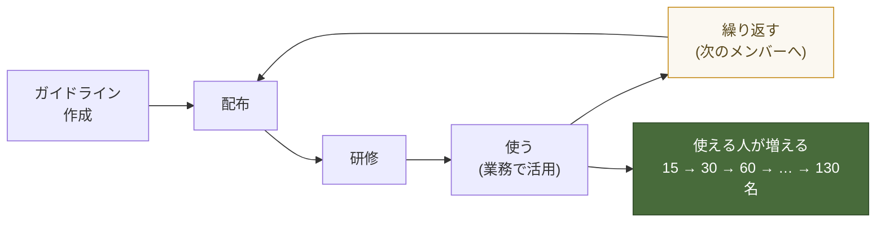

# ゼネラル Codex全社展開 方針概要書（叩き）

---

## 1. 一言でいうと

**130名がCodexを安心して業務に使える状態を「いきなり全員」ではなく「少人数から段階的に」つくる。**
そのために、まず①ガイドライン（設定と運用のルール）を配り、②研修で使い方と注意点を身につけてもらう。この①②を1セットとして繰り返し、10名→20名→30名と増やして、最終的に130名へ広げる。

**この取り組みの核心は「輪を回すこと」：**

> **ガイドラインを作る → 配布する → 研修する → 使う → 繰り返す → 使う → 繰り返す**

この輪を1周まわすたびに、安心してCodexを使える人が増えていく。1回で完成させるのではなく、回し続けることで130名まで広げる。

---

## 2. 目指す姿（ゴール）

| いつ | どうなっていたいか |
|---|---|
| 最終ゴール | ゼネラルの130名が、Codexを安心して日々の業務に使い、成果を出している |
| その手前 | 「安心して使える仕組み（設定・運用ルール・研修）」が完成し、次々に人を増やせる状態になっている |
| いま | まず第1期の少人数（15名）から研修を始める準備段階 |

**なぜ段階的にするのか（＝いきなり全員に開放しない理由）**
今のまま全員に使わせると、下記のような事故が起きるリスクがある。だからまず歯止め（安全のための仕組み）を用意してから広げる。

- 消してはいけないファイルやフォルダを、誤って削除・上書きしてしまう
- 個人情報や社外秘を、うっかりCodexに入力してしまう
- データを消す危険なコマンドが実行されてしまう
- 社内システムに、承認のないままアクセスしてしまう

---

## 3. 基本方針

1. **「安心して使える状態」を作ってから広げる。** 速さより、事故を出さないことを優先する。
2. **段階的に人数を増やす。** ガイドライン配布＋研修を1セット（コホート）として繰り返し、少人数から着実に拡大する。
3. **ルールは「歯止め」と「型」で持つ。** 個人の注意力に頼らず、設定・フォルダ運用・申請フローという仕組みで事故を防ぐ。
4. **当面はSharePoint／OneDriveを前提にする。** 仕組みが固まってきたら、必要な部分（Skill管理など）をGitHubなどへ移していく。
5. **端末はWindows管理端末、ツールはCodexデスクトップアプリ**を前提にする（受講者にGit等の新規アカウントは作らせない）。

---

## 4. 何が怖くて、どう防ぐか（リスクと歯止め）

| 想定される事故 | 歯止め（対策） | 区分 |
|---|---|---|
| データを消す・壊す危険なコマンドが動く（例：削除命令など） | **許可コマンドリスト**を用意し、許可した命令だけ実行できるようにする。UNIX系・PowerShell系の両方を対象にする | 設定 |
| 消してはいけないファイルを誤って削除・上書きする | 確定版の仕様書などは読み取り専用にする／フォルダの役割を分ける（後述） | 運用 |
| 個人情報・社外秘をうっかり入力する | 研修で「入れてよい／ダメの一覧（Good/Badリスト）」を配布し、対象範囲を明示する | 研修 |
| もとの資料ファイルを動かして所在不明になる | カスタム指示で「資料はコピーして使う。元ファイルは移動しない」を徹底する | 設定 |
| 共有フォルダで誤って消してしまった | **元に戻す（ロールバック）手順**を用意しておく | 運用 |
| 社内システムに無断でアクセスする | **申請・承認フロー**と、アクセスしてよい先の許可リストを用意する | 申請 |

---

## 5. 仕組みの整備（安心して使うための中身）

### 5-1. 設定（Codex側の初期設定）

- **許可コマンドリスト**：実行してよい命令だけを許可する。危険な命令（削除など）は既定で止める。UNIX系・PowerShell系の両方を確認する。
- **カスタム指示（共通の言いつけ）**：
  - **資料はコピーして使う。元ファイルは移動しない。**
  - 個人情報・社外秘は入力しない（Good/Badリストに従う）。
- **セキュリティ確認の仕組み（Skill）**：設定が正しく入っているかを点検する「ヘルスチェック（健康診断）」を用意する。
  - ※Skill＝Codexに覚えさせる手順のかたまり。当面はSharePoint上で配布・共有し、仕組みが固まったらGitHubで管理する形へ移していく。

### 5-2. 運用（ファイルとフォルダのルール）※当面はSharePoint／OneDrive

フォルダの役割を分けて、事故を防ぐ。

| フォルダの種類 | 置き場所 | ルール |
|---|---|---|
| 確定版の仕様書など | 共有（SharePoint） | **読み取り専用**。勝手に書き換えない |
| 更新依頼フォルダ | 共有（SharePoint） | 変更してほしいファイルはここに入れる |
| 個人の作業場所 | OneDrive（※要確認） | 個人作業はここで行う。必要な資料はコピーして持ってくる |

- **元に戻す手順（ロールバック）**：SharePointで誤って消した場合の復旧手順を用意し、どこまで戻せるかを事前に確認しておく。

### 5-3. アクセスと申請

- **社内システムへのアクセス**は、アクセスしてよい先を許可リストで明示する。
- リストにない先へアクセスしたい場合は、**申請 → 承認**のフローを通す。

---

## 6. 研修（使う人を育てる）

### 6-0. 研修には2軸ある（どちらも大事）

Codexの研修は、大きく2つの軸に分けられる。**どちらか片方では不十分で、両方をセットで行う必要がある。**

| 軸 | 内容 | 今回の位置づけ |
|---|---|---|
| ① セキュリティ運用 | Codexを使う上で気をつけること（個人情報・社外秘を入れない／危険な操作をしない／フォルダの正しい扱い など） | **今回の主軸** |
| ② セットアップ・使い方 | インストール・初期設定・基本操作・便利な使い方 | 併せて実施 |

> ②だけだと「使えるけれど事故を起こす」状態に、①だけだと「安全だけど使えない」状態になる。
> 今回はまず「安心して使える」を担保することを最優先するため、**①セキュリティ運用を主軸**に据えつつ、②の使い方研修も必ず併走させる。

### 6-1. 実施の中身

- **安全面で各回に必ず入れる内容（たたき）**：
  - 個人情報・社外秘の「入れてよい／ダメの一覧（Good/Badリスト）」
  - フォルダの使い分け（確定版は読み取り専用／作業場所／資料はコピー）
  - 受講者ごとのカスタム設定（その人の業務に合わせた初期設定）
- **やり方**：少人数で1回実施 → 振り返り → ガイドライン改善 → 次の回。これを繰り返す。
- **体制**：講師2名＋バディ制（進度のばらつきは「おかわり課題」で吸収）。

---

## 7. 展開ステップ（進め方の全体像）

| 段階 | 内容 | 状態 |
|---|---|---|
| Phase 0 | この方針の合意 | ← いまここ |
| Phase 1 | ガイドライン作成・配布（設定＝許可コマンドリスト／運用＝フォルダルール／申請フロー） | 未着手 |
| Phase 2 | 第1期（15名）に研修を実施し、安全に使い始める | 実施前 |
| Phase 3 | 第1期の振り返りでガイドラインを改善 | 未着手 |
| Phase 4 | 研修を第2期・第3期と繰り返し、10名→20名→30名→…→130名へ拡大 | 未着手 |

> Phase 1＋Phase 2が終わると「運用方針」が完成し、使用を開始できる状態になる。あとはこのセット（配布＋研修＋振り返り）を繰り返して人数を増やしていく。

---

## 8. 体制・役割（たたき）

- sento.group：方針・ガイドライン・研修設計の素案づくり、講師・伴走
- ゼネラルさま：社内ルール・システム範囲の確定、対象メンバーの選定、端末へのCodex事前インストール＋サインイン
- 柴田さま：全体方針の確認・意思決定

> ※Codexのサインインが社内プロキシで落ちる恐れがあるため、インストールとサインインは当日までにゼネラル側で完了しておく（研修当日の最大の詰まりポイント）。

---

## 9. 未確定・要確認

- 個人の作業場所はOneDriveか、**SharePointのユーザー別フォルダ**か（切り分けを確定したい）
- 「入れてよい／ダメ」の個人情報・社外秘の対象範囲をどこまで厳しくするか
- 許可コマンドリストの初版の中身（誰が承認するか含む）
- 社内システムの許可リストと、申請・承認は誰が担うか
- 研修の第2期以降のメンバー選定基準と、130名までの想定ペース（何人ずつ／どのくらいの間隔で）
- SharePointのロールバック（復旧）が実際にどこまで戻せるか

---

## 10. 作るべき成果物一覧（検討・制作リスト）

「安心して使える状態」を作るために、これから検討・制作していく物の一覧。優先度の高い順。
（優先度：高＝これが無いとPhase 1に進めない／中＝運用開始までに必要／低＝拡大フェーズで整備）

| # | 成果物 | 目的・中身 | 区分 | 優先度 | ステータス |
|---|---|---|---|---|---|
| 1 | **ガイドライン（親ドキュメント）** | 下記の設定・運用ルールを1つにまとめ、配布する土台 | 全体 | 高 | 未着手 |
| 2 | **許可コマンドリスト** | 実行してよい命令だけ許可。危険な命令は既定で停止。UNIX系・PowerShell系の両方。承認者も決める | 設定 | 高 | 未着手 |
| 3 | **カスタム指示テンプレ** | 全員共通の言いつけ（資料はコピー・元は動かさない／個人情報を入れない） | 設定 | 高 | 未着手 |
| 4 | **フォルダ構成の設計** | SharePoint／OneDriveの切り分けを確定（確定版=読み取り専用／更新依頼／個人作業） | 運用 | 高 | 未確定（§9） |
| 5 | **運用マニュアル** | フォルダの使い分け・日々の作業手順を、誰でも読める形にまとめる | 運用 | 高 | 未着手 |
| 6 | **個人情報・社外秘 Good/Badリスト** | 入れてよい／ダメの具体例集。セキュリティ研修の中核教材 | 研修 | 高 | 未着手 |
| 7 | **セキュリティ運用 研修教材** | 今回の主軸。気をつけることを体系立てて教える（Good/Badリストを含む） | 研修 | 高 | 未着手 |
| 8 | **ロールバック（復旧）手順書** | SharePointで誤削除した時に元に戻す手順。どこまで戻せるか検証込み | 運用 | 中 | 未着手 |
| 9 | **セキュリティ確認Skill（ヘルスチェック）** | 設定が正しく入っているか点検する仕組み | 設定 | 中 | 未着手 |
| 10 | **社内システムのアクセス許可リスト** | アクセスしてよい先を明示（Allowlist） | 申請 | 中 | 未着手 |
| 11 | **申請・承認フロー** | 許可リストにない先へアクセスしたい時の申請〜承認の流れ | 申請 | 中 | 未着手 |
| 12 | **受講者ごとのカスタム設定手順** | その人の業務に合わせた初期設定のやり方 | 研修 | 中 | 未着手 |
| 13 | **コホート計画（拡大ロードマップ）** | 第2期以降を何人ずつ・どの間隔で、130名まで | 全体 | 中 | 未着手 |
| 14 | **セットアップ・使い方 研修教材** | ②の軸。インストール〜基本操作〜活用 | 研修 | 中 | 一部あり |
| 15 | **Skill管理・GitHub移行フロー** | Skillの配布・更新をSharePoint→GitHubへ移す手順 | 管理 | 低 | 将来 |

---

## 11. 直近アクション（叩き）

1. この叩きをゼネラルさま・柴田さまに共有し、方針の合意をとる（次回定例）
2. 合意後、Phase 1のガイドライン初版を作成（上表の #2 許可コマンドリスト＋ #4/#5 フォルダルール・運用マニュアル＋ #10/#11 申請フロー）
3. 第1期15名の研修実施日程を確定し、Codex事前インストール＋サインインをゼネラル側で完了してもらう
