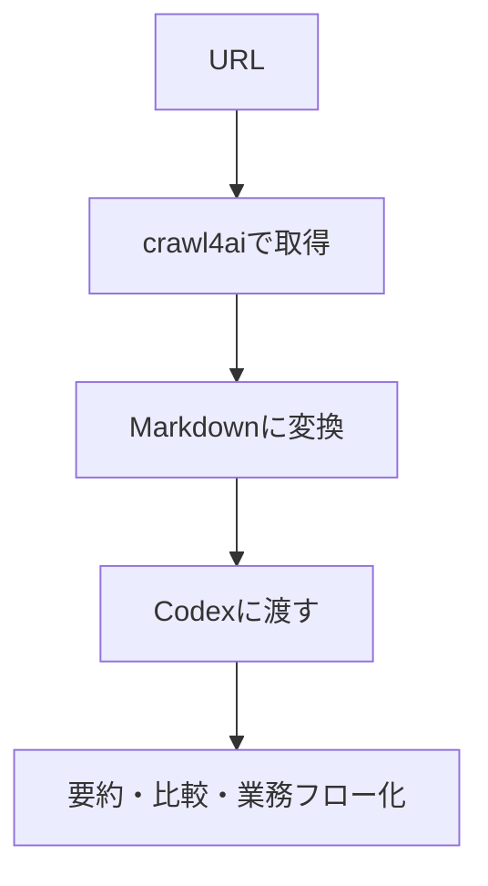

import ProgressMap from '../../../components/ProgressMap.astro';
import SectionHead from '../../../components/training/SectionHead.astro';
import IntroPunch from '../../../components/training/IntroPunch.astro';
import StepFlow from '../../../components/training/StepFlow.astro';
import Step from '../../../components/training/Step.astro';
import Callout from '../../../components/training/Callout.astro';
import PromptBlock from '../../../components/PromptBlock.astro';

<ProgressMap current="day1-pm" />

<SectionHead no="9" title="crawl4aiでWebページをInputにする" subtitle="URLを、Codexが扱いやすいMarkdownに変換する" />

<IntroPunch
  aruaru="参考ページのURLを貼っただけで、読めたつもりになってしまう。"
  dakara="crawl4aiで本文をMarkdownにしてから、CodexへInputとして渡す。"
  owari="社外ページ、製品ページ、規程ページなどを、自分の業務資料と同じように扱える。"
/>

## これは何をするものか

crawl4aiは、Webページを読み取り、余計なメニューや装飾を減らしてMarkdownに変換する道具です。

ここでは、コマンドを覚えるのではなく、GitHubの便利なリポジトリをCodexに渡して、**自分の研修フォルダで使える状態にする**ことを体験します。

目的はスクレイピング技術を覚えることではなく、**GitHubリポジトリもAIに渡せる道具箱になる**こと、そして**WebページもInputとして扱える**ことを知ることです。

## GitHubの便利リポジトリを使えるようにする

まずは、Codexに次のプロンプトを貼ります。受講者は細かいインストールコマンドを覚えなくてOKです。

<PromptBlock text={`https://github.com/unclecode/crawl4ai をCloneして、このCodexで使えるようにしてください。

目的:
- 公開WebページをMarkdown化して、CodexのInputとして使いたい
- まずは研修フォルダ内で安全に試したい
- APIキーや本番データは使わない

進め方:
- いきなり大きく設定せず、必要な手順を短く説明してから進めてください
- 必要な依存関係があれば、この環境で確認してから入れてください
- 成功確認として、公開ページを1つMarkdown化してください
- 取得結果は outputs/web-input.md に保存してください

テストURL:
https://example.com`} />

<Callout variant="tip" title="ここで覚えること">
  GitHubの便利リポジトリは、リンクを渡して「Cloneして使えるようにして」と頼めば、CodexがREADMEを読み、必要な手順を確認し、動作確認まで進められる。これは crawl4ai だけでなく、他の便利リポジトリでも使える型です。
</Callout>

## 実際のブラウザでやってみよう

次は、いま見ている研修サイトのページを題材にします。ブラウザでページを開き、URLをコピーしてCodexに渡します。

<StepFlow>
  <Step no="1" title="ブラウザでページを開く">この研修サイトの好きなページ、または公開されている製品ページを開く。</Step>
  <Step no="2" title="URLをコピー">アドレスバーのURLをコピーする。</Step>
  <Step no="3" title="Codexへ渡す">下のプロンプトにURLを貼って実行する。</Step>
  <Step no="4" title="Markdownを確認">`outputs/web-input.md` ができたら、Codexに要点整理させる。</Step>
</StepFlow>

<PromptBlock text={`先ほど使えるようにした crawl4ai で、次の公開ページをMarkdown化してください。

URL:
[ここにブラウザで開いたページのURLを貼る]

出力:
- outputs/web-input.md に保存
- 保存後、このページの要点を5行で整理
- 私の業務改善のInputとして使えそうな情報を3つ抽出
- 読み取れない箇所や推測が混じる箇所は [不明] と書く`} />

<Callout variant="warn" title="扱うURL">
  この演習では、公開されているページだけを対象にする。ログイン後の社内ページ、個人情報、顧客固有の非公開ページは使わない。
</Callout>

## Codexに読ませる

作成されたMarkdownをCodexに渡し、まずは要点を確認します。

<PromptBlock text={`outputs/web-input.md を読んでください。
このページの要点を5行で整理し、私の業務に使えそうな情報を3つ挙げてください。
不明なところは推測せず [不明] と書いてください。`} />

次に、業務フローや比較に使います。

<PromptBlock text={`outputs/web-input.md の内容を、私の「〇〇業務」の改善Inputとして使います。
関係しそうな情報だけを抜き出し、Mermaid改善ループに足す材料として整理してください。`} />

## うまくいかない時

- URLがログイン必須の場合は、公開ページに変える
- 取得結果が短すぎる場合は、別ページを試す
- エラーが出たら、エラー全文を省略せずCodexに貼る
- 何度も止まる場合は、今回は講師側の取得結果を見る
- Cloneやセットアップで止まる場合は、Codexに「いま詰まっている原因と代替案を3行で出して」と聞く

<Callout variant="tip" title="Mermaid改善ループへの接続">
  ここで作った `outputs/web-input.md` は、次のMermaid改善ループで追加Inputとして使う。音声、手書き、業務資料に加えて、Webページも材料にできる。
</Callout>

次は [Skill：段取りを部品化（10）](/day-1/skills/) へ進む。
