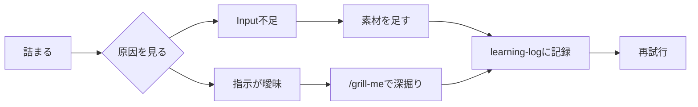

import ProgressMap from '../../../components/ProgressMap.astro';
import SectionHead from '../../../components/training/SectionHead.astro';
import IntroPunch from '../../../components/training/IntroPunch.astro';
import Callout from '../../../components/training/Callout.astro';
import StepFlow from '../../../components/training/StepFlow.astro';
import Step from '../../../components/training/Step.astro';

<ProgressMap current="day1-am" />

<SectionHead no="4" title="グランドルール・詰まったら" subtitle="完璧より前進。止まった場所を見分け、記録して次へ進む" />

<IntroPunch
  aruaru="初日はログイン、権限、入力方法、指示の出し方で止まることがある。"
  dakara="止まった箇所を見分け、エラー全文やスクショごと共有し、同じ詰まりを次の人が越えやすくする。"
  owari="うまくいかなかった点も、Day1の後半とDay2で使える改善材料になる。"
/>



## 基本ルール

<StepFlow>
  <Step no="1" title="詰まったら止めずに出す">セットアップや権限で止まるのは普通。エラー全文と画面を見せる。</Step>
  <Step no="2" title="隣を助ける">先に進んだ人はバディとして横を見る。</Step>
  <Step no="3" title="記録する">詰まった点も`learning-log/`に残すと再発防止になる。</Step>
  <Step no="4" title="機密を入れない">個人情報・鍵情報は後のセキュリティ設定と合わせて守る。</Step>
</StepFlow>

## 原因は2つに絞れる

```text
出力が微妙
   ├─ ① Input不足 …… 渡した情報が足りない
   │       → 必要な素材・前提・例・過去フォーマットを足して渡し直す
   │
   └─ ② 指示が不明確 …… AIが何を作ればいいか定まっていない
           → /grill-me で要件を深掘りして、指示を具体化してから渡す
```

- **Input不足**: 背景・制約・参考例・対象データが足りていない。インプットを足すほど出力の輪郭がはっきりする。
- **指示が不明確**: 自分でも何が欲しいか言語化できていない。ここは `/grill-me` で論点と要件を出してから指示する。

## 暴走・的外れを防ぐ

ここでは名前だけ押さえます。使い方はこの後のCodex演習で、独立パートとして実際に触ります。

- **`/plan`**: 作る前に、目的・材料・手順・確認方法を先に出させる。詳しくは [Planモードを使う](/day-1/plan-mode/) で実践する。
- **`/goal`**: 長めの作業をゴール化し、完了条件と進捗を見える状態にする。詳しくは [Goalモードを使う](/day-1/goal-mode/) で実践する。
- **`/review`**: 出したものを見直し、抜け漏れや危ない変更を確認する。
- うまくいった指示は `AGENTS.md` に永続化して、次から毎回効かせる。

<Callout variant="check" title="記録項目（最小）">
  - 何をやろうとしたか<br />
  - どこで詰まったか<br />
  - どう直したか<br />
  - 次に試すこと
</Callout>

次は [準備・セットアップ](/start/prework/) へ進みます。
