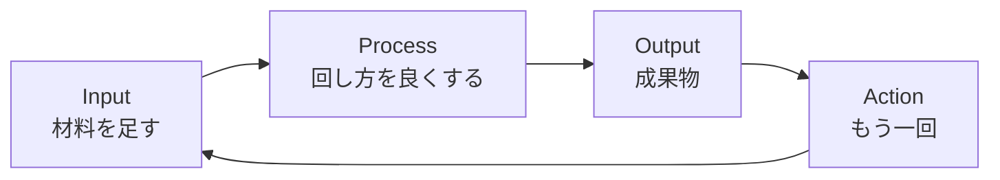

import ProgressMap from '../../../components/ProgressMap.astro';
import SectionHead from '../../../components/training/SectionHead.astro';
import Callout from '../../../components/training/Callout.astro';

<ProgressMap current="day1-am" />

<SectionHead no="3" title="IPOA＝2日間の進め方" subtitle="Inputを増やし、Processを改善する。Outputは自然とついてくる。" />

この2日間は、次の4つを回し続けます。覚えておくのは **Inputを増やす** と **Processを改善する** の2つで十分です。

| 文字 | 意味 | 2日間での例 |
|---|---|---|
| **I** Input | AIに渡す材料を増やす | プラグイン、音声、写真、業務資料、Webページ |
| **P** Process | 回し方・手順を良くする | Skill、skill-improver、Plan/Goal |
| **O** Output | 出てくる成果物 | Mermaid、HTML、報告書の下書き |
| **A** Action | もう一回回す | Inputを足してv2を作る |

<Callout variant="tip" title="合言葉（後で使う）">
  詰まったら **「IPOA回そう＝Input足してもう一回」**。完璧な初稿より、改善を回せる状態を優先する。
</Callout>

Day1 PMの [Mermaid改善ループ](/day-1/mermaid-flow/) で、この動きを自分の業務で体感します。  
全体の地図は [2日間スケジュール](/start/schedule/) と [トップ](/) で確認できます。

次は [グランドルール・詰まったら（4）](/day-1/ground-rules/) へ進みます。
