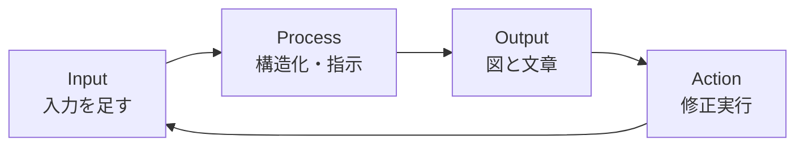
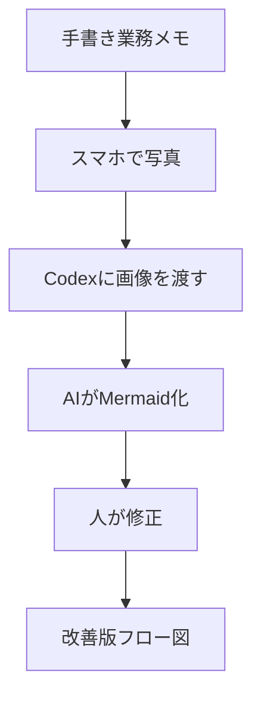

import ProgressMap from '../../../components/ProgressMap.astro';
import SectionHead from '../../../components/training/SectionHead.astro';
import IntroPunch from '../../../components/training/IntroPunch.astro';
import StepFlow from '../../../components/training/StepFlow.astro';
import Step from '../../../components/training/Step.astro';
import Callout from '../../../components/training/Callout.astro';

<ProgressMap current="day1-pm" />

<SectionHead no="12" title="Mermaid改善ループ" subtitle="粗いv1を出して、Inputを足すと変わることを確認する" />

<IntroPunch
  aruaru="最初から完璧な図を作ろうとして、手が止まる。"
  dakara="入力ゼロで粗いv1を出し、⑨で仕込んだInputを足してv2へ。"
  owari="「Input足しただけでこう変わる」を体で覚え、業務フローの可視化が日常動作になる。"
/>

## 進め方（v1→Input→v2）

<StepFlow>
  <Step no="1" title="v1をゼロInputで出す">業務名だけ投げ、AIが推測した粗いv1を受け取る。</Step>
  <Step no="2" title="Inputを足す">⑨の3手段——音声2分 / 業務資料を指す / 手書きメモの写真——のいずれかを追加。</Step>
  <Step no="3" title="v2を生成">追加Inputを反映した改善版MermaidをCodexに作らせる。</Step>
  <Step no="4" title="差分を見る">v1とv2の違いを言語化し、「Input足しただけでこう変わる」を確認する。</Step>
</StepFlow>

### v1用プロンプト（コピペ）

```text
私の「〇〇業務」の流れをMermaidのフローチャートで書いて、HTMLで可視化してください。
今は情報ゼロで構いません。AIが推測した仮のv1でOKです。
```

### v2用プロンプト（Input追加後）

```text
先ほどのMermaidフローに、以下の追加Inputを反映してv2を作り直してください。
[ここに音声文字起こし / 議事録 / 手書きメモ写真の内容を貼る]
v1との差分がわかるように、改善点も3行で教えてください。
```

<Callout variant="note" title="⑨との接続">
  手書きメモ・ホワイトボードは**写真**でCodexに渡す（⑨で演習済み）。白黒メモでも読み取れる。
</Callout>

## IPOA

v1→v2で変化を確認したら、その動きを名前で押さえる。



合言葉：**「IPOA回そう＝Input足してもう一回」**。詰まったらこの動詞で回す。

## 軽いマインド

- **完璧な計画じゃなく、改善起点。** まず粗いv1を出し、Inputを足して直す。
- スタートの精度は低くてよい。v1は、差分を見るための最初の材料。
- 長い説明はしない。この1画面で、進め方だけ確認する。

## 手書きメモ→写真→Mermaid化



## おかわり（早い人）

- フローの改善ポイントに印を付けて「ここをAIに任せるなら？」まで踏む
- うまくいった指示をSkill化して永続化（⑨と接続）
- [性格診断HTML（任意）](/extra/personality-html/) を試す

次は [Day1ふりかえり（13）](/day-1/reflect/) へ進みます。
