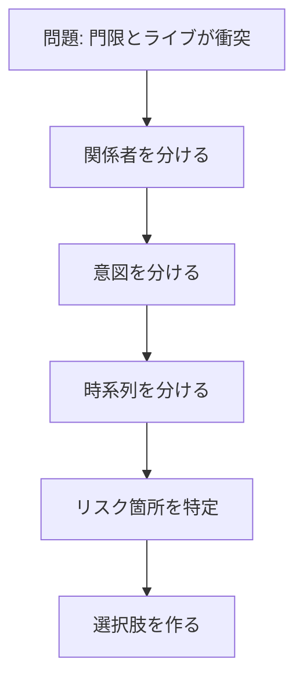

import ProgressMap from '../../../components/ProgressMap.astro';
import SectionHead from '../../../components/training/SectionHead.astro';
import IntroPunch from '../../../components/training/IntroPunch.astro';
import ImageText from '../../../components/training/ImageText.astro';
import StepFlow from '../../../components/training/StepFlow.astro';
import Step from '../../../components/training/Step.astro';
import Callout from '../../../components/training/Callout.astro';
import stakeholderImage from '../../../assets/training/uml-stakeholder.png';
import businessFlowImage from '../../../assets/training/business-flow.png';

<ProgressMap current="day1-pm" />

<SectionHead no="11" title="UML業務フローモデリング——振り返り" subtitle="門限の話を題材に、業務でも使える構造の型を見る" />

<IntroPunch
  aruaru="業務フローは、関係者・意図・時系列が混ざると見えなくなる。"
  dakara="Codex で掘ったあと、講師と一緒に構造の型を名前付きで整理する。"
  owari="仕事でも同じ——ステークホルダーとフローが分かれば、何を会話すべきかがクリアになる。"
/>

## 演習で出た気づき（口頭で確認）

- 父も娘の幸せを願っている——**対立ではなく意図の差**
- 危ないのは帰り道だけ、など**リスクの局所化**
- 解の一例：**父に迎えに来てもらう**（他案もよい）

## 演習手順（振り返り用）

<StepFlow>
  <Step no="1" title="娘の立場で投げる">下のプロンプトを Codex に貼り、まず自由に答えさせる。</Step>
  <Step no="2" title="関係者と気持ち">父・娘・会場・移動手段——**父はなぜ門限を立てるのか**を Codex に聞く。</Step>
  <Step no="3" title="当日フローを書く">友達と約束→電車→ライブ→帰宅の時系列を箇条書きで出す。</Step>
  <Step no="4" title="危ない箇所を1つ">「会場から家までの帰り」など、リスクが集中する点を特定する。</Step>
</StepFlow>

### プロンプト①：娘の立場で相談

```text
20時が門限の高校生です。推しのライブは19時〜21時で門限を超えます。
娘の立場から、この問題を整理してください。まず共感から始めてください。
```

### プロンプト②：父の気持ちを聞く

```text
この門限問題について、父親はなぜ20時門限を設定していると思いますか？
安全面と娘の幸せの両方の視点で、父の意図を3行で説明してください。
```

### プロンプト③：当日フローを可視化

```text
ライブ当日の流れを、出発→会場→終演→帰宅の時系列で箇条書きにしてください。
どこで遅延や連絡不能のリスクがありそうか、各ステップにメモを付けてください。
```

### プロンプト④：解決案を自分で出す

```text
門限とライブの衝突を解く案を3つ出してください。
各案について、誰が何をするか・リスクは何かを1行ずつ書いてください。
```

## 構造の型（ここで初めて図解）



<StepFlow>
  <Step no="1" title="関係者を分ける">娘 / 父 / 会場 / 移動手段</Step>
  <Step no="2" title="意図を分ける">安全確保 / 参加したい気持ち / 終演時刻</Step>
  <Step no="3" title="時系列を分ける">出発・開演・終演・帰宅</Step>
  <Step no="4" title="危険箇所を特定">遅延・連絡不能・混雑——帰り道に集中</Step>
  <Step no="5" title="選択肢を作る">迎え・門限調整・オンライン視聴 等</Step>
</StepFlow>

## 概念名（軽く触れる）

- **UML** — 関係者とフローを構造で見る
- **共感マップ・構造化シナリオ法・KA法** — UXモデリングの道具箱

<ImageText
  imageSrc={stakeholderImage.src}
  imageAlt="ステークホルダーの関係図"
  title="ステークホルダーを見る"
  caption="誰が関わり、誰の意図がぶつかっているかを分ける"
>
  <ul>
    <li>人・部署・外部関係者を分ける</li>
    <li>それぞれの目的と不安を出す</li>
    <li>合意が必要な相手を見つける</li>
  </ul>
</ImageText>

<ImageText
  imageSrc={businessFlowImage.src}
  imageAlt="業務フローの例"
  title="業務フローを見る"
  caption="時系列にすると、詰まりやすい場所が見える"
>
  <ul>
    <li>開始から完了までの流れを並べる</li>
    <li>引き継ぎ、承認、待ち時間を見つける</li>
    <li>AIに任せる候補を探す</li>
  </ul>
</ImageText>

<Callout variant="tip" title="業務への接続">
  仕事も同じ。ステークホルダーとフローを押さえれば、**何を会話すべきか**がクリアになる。  
  そのモデリング自体を **AI にやらせればいい** — 次のMermaid改善ループで業務に接続する。
</Callout>

[演習ページに戻る](/day-1/modeling/) · 次は [Mermaid業務フロー改善ループ（12）](/day-1/mermaid-flow/) へ進む。
