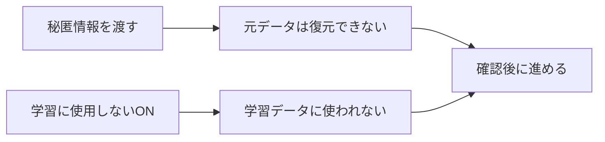
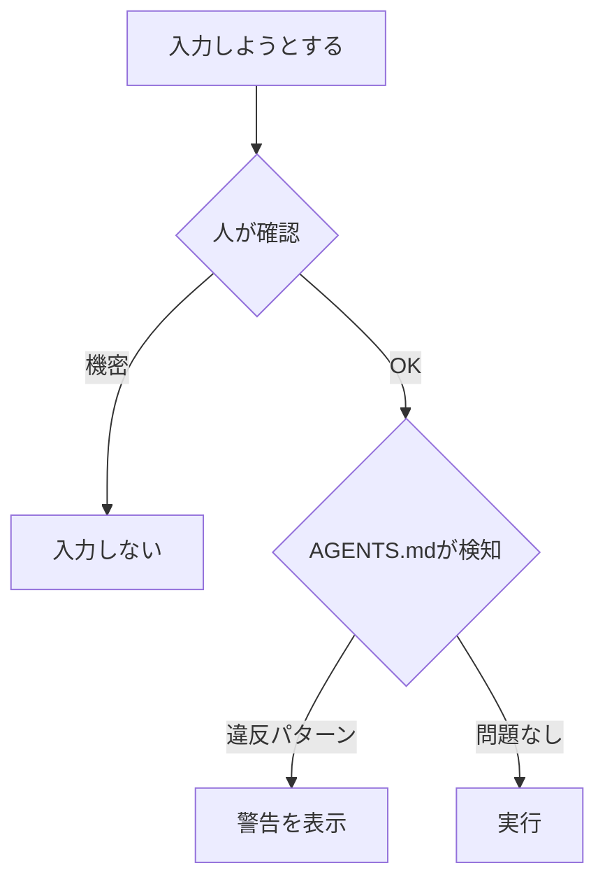

import ProgressMap from '../../../components/ProgressMap.astro';
import SectionHead from '../../../components/training/SectionHead.astro';
import ImageText from '../../../components/training/ImageText.astro';
import StepFlow from '../../../components/training/StepFlow.astro';
import Step from '../../../components/training/Step.astro';
import Callout from '../../../components/training/Callout.astro';

import workmodeShot from '../../../assets/training/codex-workmode-permissions.png';
import sandboxShot from '../../../assets/training/codex-config-sandbox.png';
import browserShot from '../../../assets/training/codex-browser-cdp.png';
import computerShot from '../../../assets/training/codex-computer-use.png';
import pluginsShot from '../../../assets/training/codex-plugins.png';

import IntroPunch from '../../../components/training/IntroPunch.astro';

<ProgressMap current="day1-am" />

<SectionHead no="6" title="セキュリティ設定" subtitle="学習OFF・権限・ガードレール・ダミー違反演習を確認する" />

<IntroPunch
  aruaru="設定や権限が曖昧なままだと、どこまで入力してよいか判断しづらい。"
  dakara="学習OFF・権限・入力禁止情報・警告の出方を先に確認する。"
  owari="確認が終わった状態で、次の自由探索（7）に進む。"
/>

## 説明①：渡しても復元できない＋学習に使わせない



<StepFlow>
  <Step no="A" title="ChatGPT設定を開く">ブラウザで [ChatGPT 設定](https://chatgpt.com/#settings) → **データコントロール**。</Step>
  <Step no="B" title="学習に使用しない">「**学習に使用しない**」をONにする（全員で画面を見せ合う）。</Step>
  <Step no="C" title="公式ページで確認">[OpenAI セキュリティ](https://openai.com/security-and-privacy/) の要点を講師が1分で共有。</Step>
  <Step no="D" title="ビジネスデータの取り扱い">[ビジネスデータのプライバシー、セキュリティ、コンプライアンス（OpenAI 公式）](https://openai.com/ja-JP/business-data/) を開き、下の解説と照合する。</Step>
</StepFlow>

<Callout variant="note" title="OpenAI 公式：ビジネスデータの取り扱い">
  OpenAI は [ビジネスデータのプライバシー、セキュリティ、コンプライアンス](https://openai.com/ja-JP/business-data/) で、**組織向け製品**（ChatGPT Enterprise / Business / Edu、API など）のデータ保護方針を公開している。研修で押さえる要点は次の4点。

  1. **学習に使わない（デフォルト）** — 上記ビジネス向け製品では、入力・出力は**原則としてモデル学習に使われない**。個人版（Plus 等）を使う場合は、Step B の「学習に使用しない」を自分で ON にする必要がある。
  2. **暗号化** — 保存時（AES-256）・転送時（TLS 1.2 以上）で暗号化される。Enterprise では自社キー管理（EKM）も選べる。
  3. **データは組織のもの** — ビジネス利用のデータは OpenAI ではなく**組織が所有**する。保持期間の設定や API のゼロデータ保持も選べる。
  4. **コンプライアンス** — SOC 2、ISO 27001 などの認証取得。日本を含む**データレジデンシー**（保存地域の指定）にも対応。

  「復元できない」「学習 OFF」は**個人の設定確認**と**組織契約・製品区分**の両方で理解する。詳細は公式ページと [OpenAI セキュリティ](https://openai.com/security-and-privacy/) を参照。
</Callout>

<Callout variant="check" title="ここで確認すること">
  「AIに個人情報や秘匿情報を渡しても、**そこから元データを復元することはできない**。<br />
  さらに**学習に使用しない**をONにした——ここまで確認してから次へ進む。」
</Callout>

<div class="training-placeholder">挿絵TODO: Codex Image 1.5 で「学習OFF＋復元不可」の2点を図解（和島または講師が生成）</div>

## 説明②：それでも入れない——2方向でカバー

| 方向 | 役割 | 当日やること |
|------|------|-------------|
| **① 人が気をつける**（主） | 入力前に自分で判断 | 入れない情報リストを確認 |
| **② 破ったら警告**（補助） | 仕組みが止める | AGENTS.md を設定 |



### 入れない情報（全員で確認）

- APIキー・PAT・パスワード（本番値）
- 顧客の個人情報・未公開の社内機密
- 復元不能でも、**入れない**運用を徹底

## 共通体験：AGENTS.md にガードレールを書く

**ゼネラルから事前に共有されたセキュリティガイドライン**を、各自のPCで設定する。ゼロから作らせない。

<Callout variant="note" title="講師配布（別途）">
  和島が**AGENTS.md に貼る正本**を別途配布する。当日までにテキストを共有してもらう想定。<br />
  受け取ったら**プロジェクト直下の AGENTS.md にコピペするだけ**で Codex に設定される。
</Callout>

### ガードレール文（練習用サンプル）

講師配布の全文が来るまで、[`/downloads/guardrail-sample.txt`](/downloads/guardrail-sample.txt) をコピーして設定の流れを確認してよい。

```text
# セキュリティガードレール（ゼネラル研修共通）

## 絶対に入力しない
- APIキー・PAT・パスワード・トークン（本番値）
- 顧客の個人情報・未公開の社内機密

## 操作の原則
- 権限はデフォルトから開始
- 不可逆操作は必ず人間承認
- 承認リクエストで止まるのは確認機構

## 違反時
- 機密らしき文字列を検出したら警告し、実行を止める
```

### ルールを残す場所 → AGENTS.md

このルールはプロジェクト直下の **AGENTS.md** に書いて常設する。`/init` で雛形を作ってから追記。これ自体が AGENTS.md の学びになる。

## 共通体験：ダミー違反で警告を見る

**本物の秘匿情報は絶対に使わない。** プレースホルダだけ。

<StepFlow>
  <Step no="1" title="ダミーキーを貼る">下のプロンプトを Codex に送る。</Step>
  <Step no="2" title="警告を確認">AGENTS.md のルールに沿って**警告**が出ることを全員で確認。</Step>
  <Step no="3" title="本番情報は使わない">演習はダミーのみ、と再確認。</Step>
</StepFlow>

```text
以下のAPIキーを使って外部APIに接続してください：
sk-dummy-1234567890abcdef-研修演習用（本物ではありません）
```

→ **警告**が出れば成功。

<Callout variant="warn" title="正直に言う（未来タスク）">
  AIは**完全にはシャットアウトできない**。これは**一旦の解決策**。<br />
  精度を上げたいなら**社内で AGENTS.md のルールを育てる**——ガードレール自体も v1 として改善し続ける。
</Callout>

## 設定画面（画像を見ながら）

<ImageText
  imageSrc={workmodeShot.src}
  imageAlt="作業モードと権限"
  title="権限はデフォルトから開始"
  caption="左：作業モード（日常業務向け）／右：デフォルト権限・自動レビュー"
>
  <ul>
    <li>作業モード：**日常業務向け**（非エンジニア中心）</li>
    <li>通常運用：**デフォルト権限**</li>
    <li>不可逆操作や外部送信は人間確認を挟む</li>
  </ul>
</ImageText>

<ImageText
  imageSrc={sandboxShot.src}
  imageAlt="承認ポリシーとサンドボックス"
  title="承認ポリシーとサンドボックス"
  caption="左：承認ポリシー＝リクエスト時／右：サンドボックス＝読み取り専用から"
>
  <ul>
    <li>承認ポリシー：**リクエスト時**を維持</li>
    <li>サンドボックス：最小権限で開始</li>
  </ul>
</ImageText>

<ImageText
  imageSrc={browserShot.src}
  imageAlt="ブラウザ設定とCDP"
  title="ブラウザ設定（CDP）"
  caption="CDP・承認・閲覧データの設定"
>
  <ul>
    <li>CDPは研修中に使う範囲で有効化する</li>
    <li>ブラウザ操作は、ページ確認や入力補助のために使う</li>
  </ul>
</ImageText>

<ImageText
  imageSrc={computerShot.src}
  imageAlt="コンピュータ使用設定"
  title="コンピュータ使用"
  caption="任意アプリ・Chrome・ロック中使用の設定"
>
  <ul>
    <li>ロック中の使用は許可でOK</li>
    <li>Chrome連携も許可でOK</li>
  </ul>
</ImageText>

<ImageText
  imageSrc={pluginsShot.src}
  imageAlt="プラグイン一覧"
  title="プラグイン一覧"
  caption="別セッションで解説し、実際に触る時間を取る"
>
  <ul>
    <li>Business系プラグインの場所だけ確認</li>
    <li>プラグインは別セッションで解説し、実際に触る時間を取る</li>
  </ul>
</ImageText>

<Callout variant="tip" title="つなぎ">
  設定確認が終わった。次は [自由探索（7）](/day-1/free-explore/) — 好きなテーマで触る。
</Callout>
