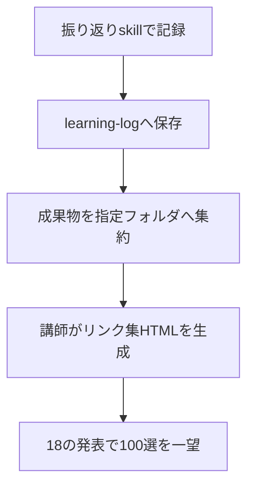

import ProgressMap from '../../../components/ProgressMap.astro';
import SectionHead from '../../../components/training/SectionHead.astro';
import IntroPunch from '../../../components/training/IntroPunch.astro';
import StepFlow from '../../../components/training/StepFlow.astro';
import Step from '../../../components/training/Step.astro';
import Callout from '../../../components/training/Callout.astro';

<ProgressMap current="day2" />

<SectionHead no="17" title="振り返りskill・仕込み" subtitle="記録と集約だけ。100選の内覧は18で行う" />

<IntroPunch
  aruaru="制作が終わっても、成果物がバラバラだと発表で見せにくい。"
  dakara="振り返りskillで記録し、指定フォルダへ成果物を集約する仕込みだけここでやる。"
  owari="講師がリンク集HTML（100選）を生成し、18で量の一望として使える状態になる。"
/>



## このセッションでやること（仕込みのみ）

<StepFlow>
  <Step no="1" title="振り返りskillを実行">[振り返りskill（reflect）](/day-1/skills/reflect/) を実行し、`learning-log/` へ保存。</Step>
  <Step no="2" title="成果物を集約">URL・ファイルを指定フォルダへ置く（講師側で一覧HTML生成の材料）。</Step>
  <Step no="3" title="100選テンプレを確認">講師は `/downloads/ai-100-list-template.html` を材料にリンク集を生成する。</Step>
  <Step no="4" title="発表の準備">18で話す「変わったこと・成果物」を3行メモにまとめる。</Step>
</StepFlow>

## 100選HTMLの生成（講師またはCodex）

```text
各参加者の learning-log/ と SharePoint 成果物フォルダを読み、
/downloads/ai-100-list-template.html をベースに AI活用100選 のHTMLを生成してください。
氏名・できたこと・詰まったこと・直し方・成果物リンクを表に埋めてください。
```

<Callout variant="note" title="ここではやらない">
  - **100選をここで一望しない**（→ 18ラストで行う）<br />
  - **明日試すInput宣言**もここではしない（→ 18全員発表で全員が口に出す）
</Callout>

<Callout variant="check" title="100選の位置づけ（先読み）">
  100選は**埋め続ける器**。完成品ではなく、18で開いたまま終える。
</Callout>

次は [全員発表・クローズ（18）](/day-2/reflection/) へ進みます。
