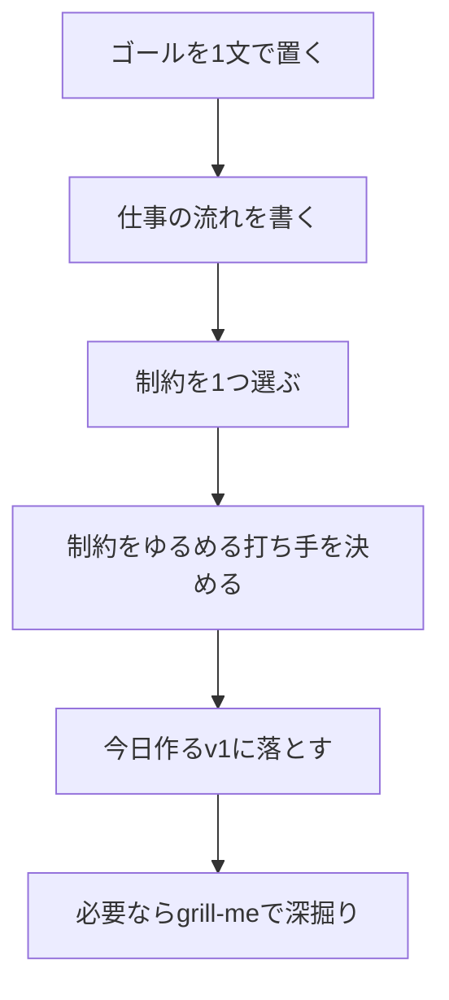

import ProgressMap from '../../../components/ProgressMap.astro';
import SectionHead from '../../../components/training/SectionHead.astro';
import IntroPunch from '../../../components/training/IntroPunch.astro';
import BenefitCards from '../../../components/training/BenefitCards.astro';
import StepFlow from '../../../components/training/StepFlow.astro';
import Step from '../../../components/training/Step.astro';
import Callout from '../../../components/training/Callout.astro';
import theGoalBook from '../../../assets/training/the-goal-book.png';

<ProgressMap current="day2" />

<SectionHead no="14" title="TOC業務棚卸し" subtitle="課題を出し切り、AIを向ける対象を決める" />

<IntroPunch
  aruaru="やりたいことを聞かれても、まだ頭の中でぼんやりしている。"
  dakara="まず課題や不満を出し切り、分類してからAIを向ける対象を選ぶ。"
  owari="制作テーマが言語化され、Day2の実装対象を迷わず決められる。"
/>

<BenefitCards
  items={[
    { title: 'ゴールから見る', text: '忙しさではなく、成果物が前に進む流れを見る。' },
    { title: '制約を1つ選ぶ', text: '全部を直さず、詰まりが全体を止めている場所を探す。' },
    { title: '制作テーマへ落とす', text: '制約をゆるめるv1を決め、今日作るものに変換する。' },
  ]}
/>

## ここでいうTOC

TOC（制約理論）は、『ザ・ゴール』で有名になった考え方です。  
ざっくり言うと、**全体の成果は一番詰まっている場所に引っ張られる**、という見方です。

<figure class="training-overview-image">
  
  <figcaption>TOC（制約理論）の入口として扱う『ザ・ゴール』。ここでは理論の暗記ではなく、詰まりを1つ見つけて制作テーマへ落とすために使う。</figcaption>
</figure>

この研修では、TOCを難しい経営理論として扱いません。Day2でやるのは、次の3つだけです。

1. 仕事のゴールを1文で置く
2. そのゴールを止めている制約を1つ選ぶ
3. 制約をゆるめる小さな成果物をCodexで作る

<Callout variant="check" title="全部をAI化しない">
  AIを向ける場所は、便利そうな作業ではなく、流れ全体を止めている場所から選ぶ。そこにInput、Process、Outputのどれを足すと前に進むかを見る。
</Callout>



## 当日ワーク手順

<StepFlow>
  <Step no="1" title="ゴールを書く">この仕事がうまくいったと言える状態を1文で置く。</Step>
  <Step no="2" title="5分で書き出す">課題、不満、面倒、止まっていることを大量に書く。</Step>
  <Step no="3" title="制約を選ぶ">全体の流れを一番止めているものを1つ選ぶ。</Step>
  <Step no="4" title="IPOAで分解する">Input不足、Processの詰まり、Outputの曖昧さに分ける。</Step>
  <Step no="5" title="制作テーマにする">制約をゆるめる成果物やSkillを1つ選ぶ。</Step>
  <Step no="6" title="TSVに落とす">`/downloads/toc-roadmap-template.tsv` をコピーし、制作候補を表形式にする。</Step>
</StepFlow>

## 制約を選ぶ基準

| 見るもの | 問い | AIで作るものの例 |
|---|---|---|
| Input不足 | 判断材料や過去例が足りないせいで止まっていないか | 資料要約、過去事例一覧、ヒアリング項目 |
| Processの詰まり | 毎回同じ判断や整形で時間を使っていないか | 手順書、チェックリスト、Skill |
| Outputの曖昧さ | 何を出せば完了かが人によって違っていないか | テンプレート、提出フォーマット、レビュー観点 |
| 待ち時間 | 誰かの確認待ちが全体を止めていないか | 依頼文、承認用サマリー、比較表 |
| 手戻り | 後工程で差し戻しが多くないか | 事前確認リスト、品質基準、FAQ |

<Callout variant="warn" title="筋悪な選び方">
  「簡単に作れそう」だけで選ばない。簡単でも流れを変えないものは後回しでよい。まずは詰まりを1つゆるめる。
</Callout>

## Codexに棚卸しを手伝わせる

```text
私の業務をTOC（制約理論）の観点で棚卸ししてください。

業務名：
この業務のゴール：
今困っていること：
関係者：
使える資料：

次の順で整理してください。
1. 仕事の流れ
2. 全体を止めている制約候補
3. Input不足 / Processの詰まり / Outputの曖昧さ の分類
4. 今日Codexで作ると効果がありそうなv1候補を3つ
5. 一番筋が良い候補と、その理由
```

## ロードマップ＋実施事項TSV

ポストイットやホワイトボードで出した候補を、次のTSVテンプレートに転記します。

```text
/downloads/toc-roadmap-template.tsv
```

Codexへの依頼例:

```text
TOC棚卸しの結果を /downloads/toc-roadmap-template.tsv の列形式で整理してください。
列は「担当」「作るもの」「困りごと」「足すInput」「直すProcess」「今日作るv1」「明日試す一歩」「優先度」「状態」。

優先度は、次の観点で付けてください。
- 制約をゆるめる度合い
- 今日v1まで出せるか
- 明日実務で試せるか
```

<Callout variant="tip" title="2チーム2島">
  Day2 AM は同じ2チームで2島に分かれて進める。表はチームごとに1枚でよい。
</Callout>

<Callout variant="note" title="進め方">
  詳細な進行は講師がリードする。ここでは、課題を出し切ってから分類し、AIを向ける対象を決める流れだけ押さえる。
</Callout>

## 単語登録用プロンプト（ぐりる）

```text
この件のあらゆる側面について執拗にインタビューして。共通理解に達するまで、デザインの因果関係と決定事項間の依存関係を1つずつ解決し、各質問に推奨回答も提示して。
```

## 深掘り結果を反映するプロンプト

```text
今のインタビュー結果を、次の3つに分けて整理してください。
1. AGENTS.mdに入れるべき恒久ルール
2. state.mdに入れるべき現在の重点テーマ
3. memory.mdに入れるべき長期的な会社情報・判断軸

そのうえで、初回の実務タスクとして一番筋が良いものを1つ選んでください。
```

## 辞書登録（時短）

- Macユーザ辞書: よみに `ぐりる`、単語に上記プロンプトを登録
- Google日本語入力: 辞書ツールで同様に登録

<Callout variant="tip" title="参考">
  詳細背景: [AI Hero - My Grill Me Skill Has Gone Viral](https://www.aihero.dev/my-grill-me-skill-has-gone-viral)
</Callout>

次は [作業分担と着手（15）](/day-2/assign/) へ進む。
