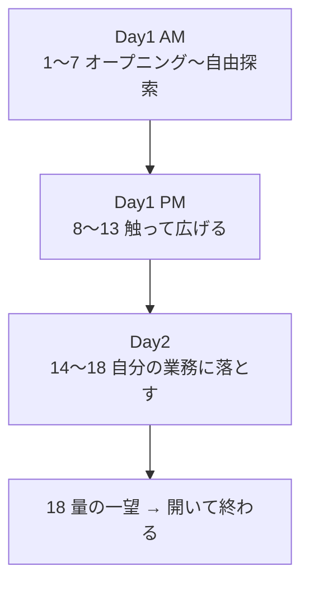

import ProgressMap from '../../../components/ProgressMap.astro';

<ProgressMap current="start" />

通し番号 **1〜18** で進めます。時間は目安です（当日調整可）。  
迷ったら [トップ](/) のボードで「今どこ」を確認してください。

## Day1 AM（1〜7）触って広げる

| # | セッション | 目安 | ページ |
|---|---|---|---|
| 1 | オープニング | 20分 | [オープニング](/day-1/intro/) |
| 2 | なぜAIを使うか | 10分 | [なぜAI](/day-1/why-ai/) |
| 3 | IPOA：進め方の地図 | 15分 | [IPOA](/day-1/ipoa/) |
| 4 | グランドルール・詰まったら | 20分 | [グランドルール](/day-1/ground-rules/) |
| 5 | 事前準備・セットアップ | 60分 | [事前準備](/start/prework/) |
| 6 | セキュリティ設定 | 30分 | [セキュリティ](/day-1/security/) |
| 7 | 自由探索 | 30分 | [自由探索](/day-1/free-explore/) |

## Day1 PM（8〜13）Input × Process を回す

| # | セッション | 目安 | ページ |
|---|---|---|---|
| 8 | Codexを操る | 50分 | [概要](/day-1/codex-mastery/) / [AGENTS.md](/day-1/agents-logging/) / [Plan](/day-1/plan-mode/) / [Goal](/day-1/goal-mode/) |
| 9 | Input：プラグイン・音声・写真・資料 | 40分 | [プラグイン](/day-1/plugins/) / [入力方法](/day-1/input-methods/) / [crawl4ai](/day-1/crawl4ai/) |
| 10 | Skill：段取りを部品化 | 40分 | [Skill](/day-1/skills/) |
| 11 | 門限の話＝モデリング | 30分 | [門限モデリング](/day-1/modeling/) |
| 12 | Mermaid業務フロー改善ループ | 70分 | [Mermaid改善ループ](/day-1/mermaid-flow/) |
| 13 | Day1ふりかえり | 30分 | [Day1ふりかえり](/day-1/reflect/) |

## Day2（14〜18）自分の業務に落とす

| # | セッション | 目安 | ページ |
|---|---|---|---|
| 14 | 業務棚卸し（TOC／ザ・ゴール） | 90分 | [業務棚卸し](/day-2/work-inventory/) |
| 15 | 作業分担・着手 | 15分 | [分担](/day-2/assign/) |
| 16 | 本制作 v1→v2 | 150分 | [本制作](/day-2/production/) |
| 17 | 振り返りskill・仕込み | 20分 | [仕込み](/day-2/showcase/) |
| 18 | 全員発表・クローズ | 50分 | [発表・ふりかえり](/day-2/reflection/) |

次は [オープニング（1）](/day-1/intro/) へ進みます。
